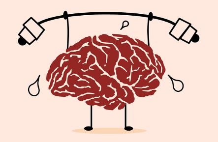

After learning the basics of javascript I think it’s a unique and interesting language. Before javascript I had basic experience in C and java. Compared to those two languages I think the barrier for entry is much lower with how flexible variables are in javascript. They aren’t constrained to being “string” or “int”, they are just variables. If someone who knew nothing about programming wanted to learn I would definitely recommend learning javascript first. 

Athletic software engineering has been really enjoyable so far. It’s a breath of fresh air compared to usual homework assignments. Having a test-like mindset and environment when doing practice WODs has made coding a bit more exciting for me. Prior to the first week of WODs I was nervous about it, thinking that that sort of pressure might affect my performance, but it had the opposite effect. I felt like my mind was sharpened as I did the WODs and that focused mindset will help me learn the harder subjects a lot.
