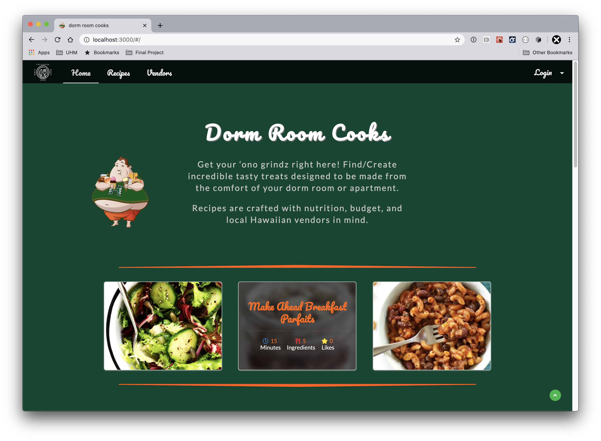

Dorm room cook is an application aimed towards students who live in a dorm used for finding and sharing recipes that are convenient and tasty. Vendors are also able to display and edit their items on our page to see availability and price. Recipes can be filtered to suit the needs of the student.
 
 
See more info <a href="https://dorm-room-cook.github.io/">here</a>.

  

During this project I came up with the mockup pages for the vendor pages, contributed recipes and vendors for the default data, and worked a bit on the functionality of the pages. 

From this project I learned that communication is an important part of group projects, and github makes that process a lot more streamlined through project management in the project board. 
 
 
See the source code at our github organization page <a href="https://github.com/dorm-room-cook">here</a>.

